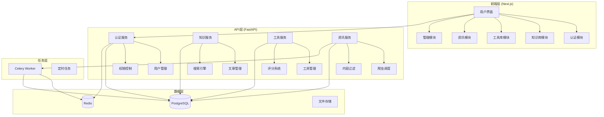
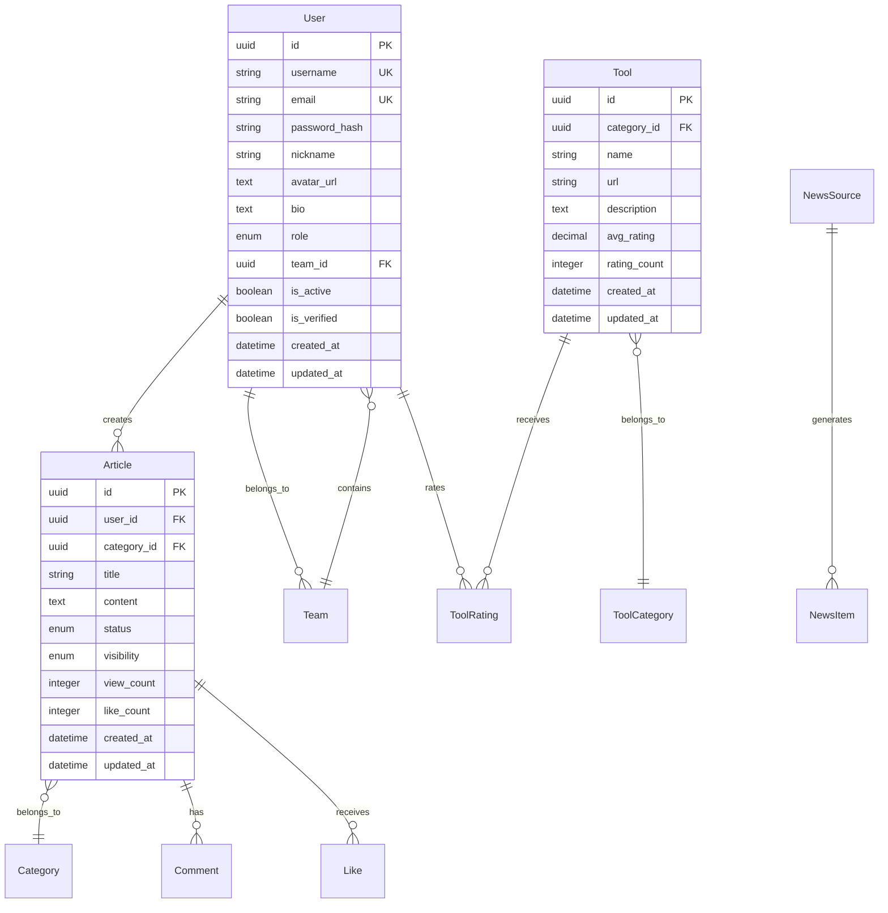

# QA测试知识协作平台 - 设计文档

## 概述

QA测试知识协作平台采用现代化的全栈架构，专为测试团队协作场景设计。系统优先使用成熟框架的内置功能，确保快速MVP交付。平台分为前端用户界面、后端API服务、数据存储层和任务调度系统四个核心部分，支持测试团队的知识管理、工具共享、行业资讯和团队协作需求。

## 技术选型

### 前端技术栈
- **框架**: Next.js 14 (App Router)
  - 理由: 内置SSR/SSG、文件路由、API Routes，开发效率高
  - 版本: 14.x (最新稳定版)
- **UI组件库**: Ant Design 5.x
  - 理由: 组件丰富，中文友好，快速构建管理界面
- **状态管理**: Zustand
  - 理由: 轻量级，TypeScript友好，学习成本低
- **编辑器**: @uiw/react-md-editor
  - 理由: 支持Markdown，预览功能完善，易于集成
- **样式方案**: Tailwind CSS + Ant Design
  - 理由: 快速样式开发，与组件库良好兼容

### 后端技术栈
- **框架**: FastAPI 0.104+
  - 理由: 高性能异步框架，自动API文档，类型提示完善
- **数据库**: PostgreSQL 15+
  - 理由: 功能强大，支持JSON字段，内置全文搜索(无需ES)
- **ORM**: SQLAlchemy 2.0 + Alembic
  - 理由: 成熟稳定，支持异步操作，迁移管理完善
- **认证**: FastAPI-Users
  - 理由: 开箱即用的用户管理，支持多种认证方式
- **任务队列**: Celery + Redis
  - 理由: 成熟的异步任务处理，支持定时任务
- **爬虫**: httpx + BeautifulSoup4
  - 理由: 异步HTTP客户端，HTML解析简单可靠
- **搜索**: PostgreSQL Full-Text Search
  - 理由: MVP阶段使用PG内置搜索，避免引入ES复杂性

### 开发工具
- **语言**: Python 3.11+, TypeScript 5.x
- **包管理**: Poetry (Python), pnpm (Node.js)
- **代码质量**: Black, isort, ESLint, Prettier
- **容器化**: Docker + Docker Compose

## 架构设计

### 系统整体架构



## 数据模型设计

### 核心实体关系



## 接口设计

### 认证相关API

```typescript
// 用户注册
POST /api/v1/auth/register
{
    "username": "string",
    "email": "string", 
    "password": "string"
}

// 用户登录
POST /api/v1/auth/login
{
    "email": "string",
    "password": "string"
}

// 获取当前用户信息
GET /api/v1/auth/me
```

### 知识库API

```typescript
// 获取文章列表
GET /api/v1/knowledge/articles?category=uuid&page=1&size=20

// 创建文章
POST /api/v1/knowledge/articles
{
    "title": "string",
    "content": "string",
    "category_id": "uuid",
    "visibility": "private|team|public"
}

// 搜索文章
GET /api/v1/knowledge/search?q=keyword&category=uuid
```

### 工具库API

```typescript
// 获取工具列表
GET /api/v1/tools?category=uuid&page=1&size=20

// 工具评分
POST /api/v1/tools/{tool_id}/rating
{
    "rating": 5,
    "review": "string"
}
```

## 安全设计

### 认证与授权
- JWT令牌认证，24小时过期
- 基于角色的权限控制 (RBAC)
- 密码使用bcrypt加密存储
- 支持密码强度验证

### 数据安全
- 所有API使用HTTPS传输
- 敏感数据加密存储
- SQL注入防护
- XSS攻击防护

### 访问控制
- 三级权限模型：Member/Admin/SuperAdmin
- 内容可见性控制：私有/团队/公开
- API访问频率限制
- 操作日志记录

## 性能优化

### 数据库优化
- 合理的索引设计
- 查询优化和分页
- 连接池配置
- 读写分离（后期）

### 缓存策略
- Redis缓存热点数据
- 用户会话缓存
- 搜索结果缓存
- 静态资源CDN

### 前端优化
- 代码分割和懒加载
- 图片压缩和优化
- 组件缓存
- 服务端渲染(SSR)

## 部署架构

### 开发环境
```yaml
services:
  frontend:
    build: ./frontend
    ports: ["3000:3000"]
    
  backend:
    build: ./backend
    ports: ["8000:8000"]
    depends_on: [db, redis]
    
  db:
    image: postgres:15
    
  redis:
    image: redis:7-alpine
```

### 生产环境
- Docker容器化部署
- Nginx反向代理
- 数据库主从复制
- 自动备份和监控

## 测试策略

### 后端测试
- 单元测试：pytest
- 集成测试：TestClient
- 数据库测试：pytest-postgresql
- 覆盖率目标：>80%

### 前端测试
- 组件测试：Jest + React Testing Library
- E2E测试：Playwright
- 类型检查：TypeScript strict mode

## 监控与运维

### 监控指标
- 系统性能指标
- 业务指标监控
- 错误日志收集
- 用户行为分析

### 运维自动化
- 自动化部署
- 健康检查
- 自动扩缩容
- 故障恢复

## 扩展性设计

### 水平扩展
- 无状态服务设计
- 数据库分片策略
- 缓存集群
- 负载均衡

### 功能扩展
- 插件化架构
- 微服务拆分
- API版本管理
- 第三方集成接口