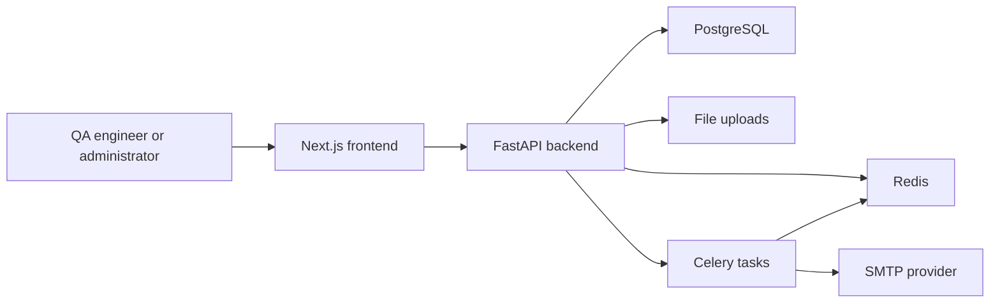

# Architecture

QA Knowledge Platform is a modular full-stack application for SaaS and game QA collaboration.

## System Context



## Frontend

The frontend lives in `frontend/`.

- Routes: `frontend/src/app/`
- Shared UI: `frontend/src/components/`
- API clients: `frontend/src/lib/api/`
- Auth store: `frontend/src/lib/store/auth.ts`
- Types: `frontend/src/types/`

The application uses Next.js App Router, Ant Design, Tailwind CSS, and typed API clients. Core workspaces include knowledge, files, tools, news, profile, and notification administration.

## Backend

The backend lives in `backend/`.

- App entrypoint: `backend/app/main.py`
- Configuration: `backend/app/core/config.py`
- API router: `backend/app/api/v1/router.py`
- Domain modules: `backend/app/modules/`
- Migrations: `backend/alembic/`
- Tests: `backend/tests/`

Business modules are grouped by capability:

- `users`: authentication, profile, teams, admin user governance, one-time auth tokens.
- `knowledge`: article CRUD, approval, comments, likes, favorites, metrics.
- `files`: authenticated uploads, listing, download, delete, evidence linking.
- `tools`: QA tool catalog, ratings, favorites, usage tracking.
- `news`: QA intelligence items, source governance, publish/reject flow.
- `notifications`: settings, templates, previews, test email, logs.
- `audit`: auditable operational events.
- `intelligence`: deterministic source-backed recommendations and summaries.

## Data Flow

1. The browser calls backend APIs through typed frontend clients.
2. The backend validates JWT authentication and role permissions.
3. SQLAlchemy persists domain data to PostgreSQL.
4. Redis backs cache and Celery queues.
5. Celery handles asynchronous notification and news tasks.
6. Uploaded evidence is stored locally in development and in the configured production upload volume.

## Database and Migrations

Alembic migrations are the release-grade database change mechanism. The current acceptance matrix requires a single Alembic head and a successful fresh empty database upgrade.

Runtime startup still creates tables through `create_tables()` for developer resilience, but production rollout must run:

```bash
poetry run alembic upgrade head
```

## Acceptance Architecture

The project keeps release evidence in scripts rather than manual-only checks:

- Backend regression: `pytest tests/ --cov=app`
- Migration graph: `alembic heads` and fresh `alembic upgrade head`
- Frontend gates: `pnpm type-check`, `pnpm lint`, `pnpm build`
- Runtime acceptance: `scripts/verify-runtime-acceptance.js`
- Browser acceptance: `scripts/verify-ui-acceptance.js`
- Real E2E acceptance: `scripts/verify-e2e-real-acceptance.js`

See `docs/plans/acceptance-matrix-saas-game-qa.md` for release evidence.
