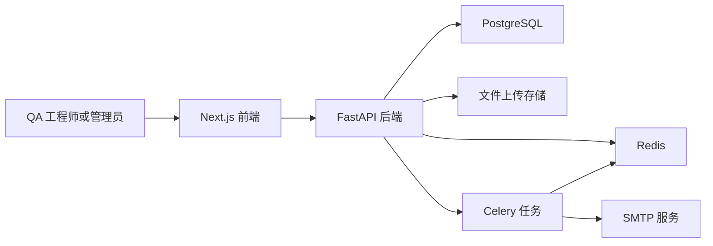

# 系统架构

QA 知识协作平台是一个面向 SaaS 与游戏 QA 协作场景的模块化全栈应用。

## 系统上下文



## 前端

前端位于 `frontend/`。

- 页面路由：`frontend/src/app/`
- 共享组件：`frontend/src/components/`
- API 客户端：`frontend/src/lib/api/`
- 认证状态：`frontend/src/lib/store/auth.ts`
- 类型定义：`frontend/src/types/`

前端使用 Next.js App Router、Ant Design、Tailwind CSS 和类型化 API 客户端。核心工作台包括知识库、文件、工具、资讯、个人资料和通知管理。

## 后端

后端位于 `backend/`。

- 应用入口：`backend/app/main.py`
- 配置：`backend/app/core/config.py`
- API 路由：`backend/app/api/v1/router.py`
- 业务模块：`backend/app/modules/`
- 数据库迁移：`backend/alembic/`
- 测试：`backend/tests/`

业务模块按能力划分：

- `users`：认证、个人资料、团队、管理员用户治理、一次性认证 token。
- `knowledge`：文章 CRUD、审批、评论、点赞、收藏、指标。
- `files`：认证上传、列表、下载、删除、证据关联。
- `tools`：QA 工具目录、评分、收藏、使用记录。
- `news`：QA 情报、来源治理、发布/驳回流程。
- `notifications`：设置、模板、预览、测试邮件、日志。
- `audit`：可审计的业务事件。
- `intelligence`：确定性的、带来源依据的推荐和摘要。

## 数据流

1. 浏览器通过前端类型化客户端调用后端 API。
2. 后端校验 JWT 认证和角色权限。
3. SQLAlchemy 将业务数据持久化到 PostgreSQL。
4. Redis 支撑缓存和 Celery 队列。
5. Celery 处理异步通知和资讯任务。
6. 开发环境文件存储在本地，生产环境文件存储在 Docker 持久化卷中。

## 数据库与迁移

Alembic 是发布级数据库变更机制。验收矩阵要求迁移图只有一个 head，并且空数据库可以成功升级到最新版本。

运行时仍会通过 `create_tables()` 创建表，以增强开发环境容错；生产发布必须执行：

```bash
poetry run alembic upgrade head
```

## 验收架构

项目将发布证据固化在脚本中，而不是仅依赖人工检查：

- 后端回归：`pytest tests/ --cov=app`
- 迁移图：`alembic heads` 和空库 `alembic upgrade head`
- 前端门禁：`pnpm type-check`、`pnpm lint`、`pnpm build`
- 运行态验收：`scripts/verify-runtime-acceptance.js`
- 浏览器验收：`scripts/verify-ui-acceptance.js`
- 真实 E2E 验收：`scripts/verify-e2e-real-acceptance.js`

发布证据详见 `docs/plans/acceptance-matrix-saas-game-qa.md`。
